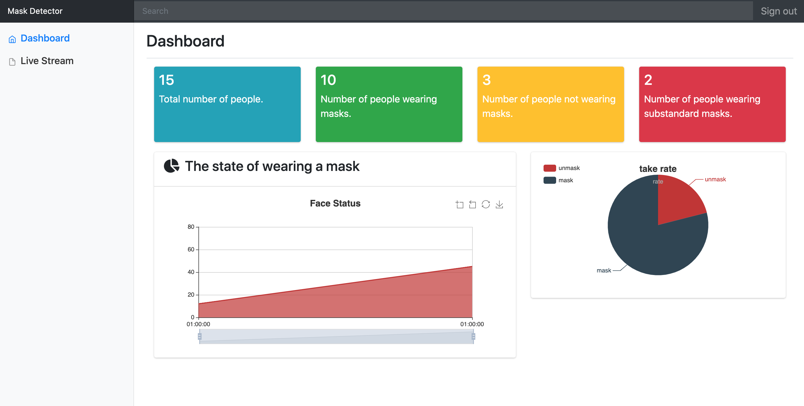
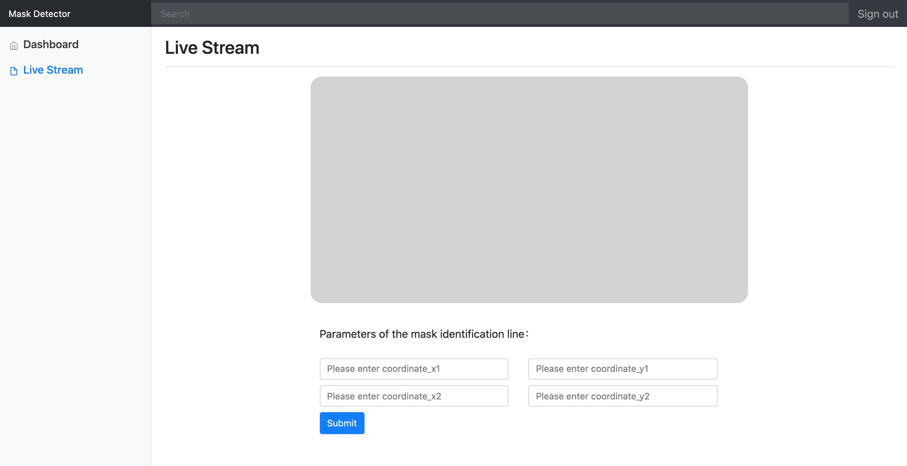

@mainpage Face Mask Detector

<br />

<div align="center">
    
</div>

<h1 align="center">Face_Mask_Detector</h1>

<!-- TABLE OF CONTENTS -->

<details open="open">
  <summary>Catalogue</summary>
  <ol>
    <li><a href="#story">Story</a></li>
    <li>
      <a href="#about-the-project">About The Project</a>
      <ul>
        <li><a href="#components-used">Components Used</a></li>
        <li><a href="#built-with">Built With</a></li>
      </ul>
    </li>
    <li>
      <a href="#getting-started">Getting Started</a>
      <ul>
        <li><a href="#prerequisites">Prerequisites</a></li>
        <li><a href="#installing">Installing</a></li>
      </ul>
    </li>  
    <li><a href="#usage">Usage</a></li>
    <li><a href="#license">License</a></li>
    <li><a href="#authors">Authors</a></li>
    <li><a href="#acknowledgements">Acknowledgements</a></li>
  </ol>
</details>

## Story
Since the outbreak of the epidemic in 2020, it has still not been controlled, and wearing a mask is the most effective way to prevent infection, so our idea for this project is to make a mask detector. The face mask detector is a real-time mask detection application based on Raspberry Pi.
It can detect in real time whether pedestrians passing by the detector are wearing masks, and give a judgment result. If wearing a mask will give a green face recognition box, otherwise it will give a red face recognition box.

Besides that, some statistics, for example, the ratio of people wearing face coverings can be useful to the government.

## About The Project
This project is consisted of two independent application:
* a c++ program running on raspberry pi 4 (connected with a pi camera), which can
  * recognize whether a passenger is wearing a mask or not
  * detect whether he or she is entering this zone (by setting a line in the )
  * provide a web interface for communication through fastcgi 
* a web application exploiting the data produced by c++ program which can
  * display a simple dashboard
  * use the fastcgi web interface to see the realtime processed image from camera.

### Components Used

* [Tensorflow Lite C++ API](https://www.tensorflow.org/lite/)
* [OpenCV C++ API](https://opencv.org/)
* [CppTimer](https://github.com/berndporr/cppTimer)
* [JsonFastCGI](https://github.com/berndporr/json_fastcgi_web_api)
* [cppThread](https://github.com/berndporr/cppThread)
* [Boost](https://www.boost.org/)
* [Nginx](https://nginx.org/en/), see `nginx-sites-enabled-default` file under `assets` folder
* [FlatBuffer](https://github.com/google/flatbuffers)
* [mysql](https://www.mysql.com/)

### Built With
* [CMake](https://cmake.org/)

## Getting Started
### Prerequisites

Before starting playing around FaceMaskDetector on your personal devices, firstly you need to
* install OpenCV
* install Tensorflow Lite C++ (2.6.0 in this project), there might be some problems when building TFL under 32-bit raspberry pi, it is recommended to refer to [this tutorial](https://qengineering.eu/install-tensorflow-2-lite-on-raspberry-pi-4.html)
* configure nginx correctly so that the request can be accepted by the cgi handler

### Build

To build this project, follow the next steps:
```sh
    git clone https://github.com/Hannidiot/Face_Mask_Detector
    # before building this project, it's better to check CMakeList.txt that every prerequisite is at right position.
    cd Face_Mask_Detector
    cmake .
    make
    ./src/FaceMaskDetector
```

If no error generated, then the program is running! To see the realtime processed image, try launching the web application.

### Test
```sh
    cmake .
    make
    make test
```

### Web Application Deployment

See /src/html/web/readme.md for more info.

## Usage

When the application starts running, we can visit `localhost:5000/dashboard` to see a simple dashboard
with some related information.



We can also visit `localhost:5000/liveStream` to see the realtime processed image generated by the 
raspberry pi. The entry line could be set from the webpage, people crossing the entry line will trigger a
function to record this entrance and whether he or she is wearing a face covering.




## License

Distributed under the Apache License 2.0. See [`LICENSE`](https://github.com/RTEP-zero-to-one/FacialDecorationTracing/blob/dev/LICENSE) for more information.

## Authors

* **Junhao Cheng** (https://github.com/JHCCCoder) 
* **Minhao Han** (https://github.com/Hannidiot)
* **Xiaoyang Wang** (https://github.com/littlesheep666)
* **Ning li** (https://github.com/Kiva1020)

## Acknowledgements
* Face Mask Detection code and model from https://github.com/Qengineering/TensorFlow_Lite_Face_Mask_RPi_64-bits.git
* Real time coding inspired by and the software engineering way to proceed project learning from https://github.com/ESE-Peasy/PosturePerfection
